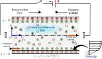

# Enhancing Electrokinetic Energy Harvesting via Rheology and Slip-Responsive Zeta Potential

This repository contains the code and data associated with the manuscript:

> **Enhancing Electrokinetic Energy Harvesting via Rheology and Slip-Responsive Zeta Potential**  
> *Aritra Roy (IIT Bombay) and Antarip Poddar (IIT(ISM)       Dhanbad)*  
 

## 📖 Overview

This work presents a comprehensive theoretical framework to investigate the interaction between slip responsive zeta potential at the channel surface and the complex fluid rheology of the fluid medium modeled using the Carreau-Yashuda constitutive relation. The model in the present study consists of pressure-driven flow through a parallel-plate micro/nanochannel of width $2H$, filled with a symmetric monovalent electrolyte (e.g., NaCl, KCl). The channel walls are **negatively charged** and hydrophobic, characterized by a slip length $L_s$ and a slip-dependent zeta potential $\zeta(L_s)$. A pressure gradient drives ion motion, creating a **streaming potential $E_s$** and an opposing induced electroosmotic flow. The flow is considered fully developed, steady, and symmetric about the channel centerline.

  
   
  <em>Schematic of combined pressure-driven and electroosmotic flow in a microchannel.</em>

We have adopted regular perturbation methodology to solve the coupled electrohydrodynamics equations for low Wiessenberg number (Wi), alongside a numerical solution is also obtained using COMSOL Multiphysics commercial code (using the Finite Element Method). The close agreement of the present results with the earlier studies in the limiting condition of Newtonian fluid medium validates the numerical solution reported in the present work

  
  
   
  <em>a) Comparison of electrostatic potential for different slip responsive zeta potentials with <a href="https://doi.org/10.1007/s10404-009-0536-0">Soong et. al. (2009)</a></em>; b) Comparison of streamwise velocity (<i>u*</i>) for a Newtonian fluid with 
  <a href="https://dx.doi.org/10.1088/1402-4896/ad164f">Liu et al. (2024)</a></em>

## 🔑 Key Findings

Our analysis reveals that as the electrokinetic separation parameter <em>K</em> decreases, the velocity profile approaches the classical Poiseuille shape. <strong>Pseudoplastic fluids</strong> (<em>n &lt; 1</em>) experience reduced viscous resistance and yield higher velocities, whereas <strong>dilatant fluids</strong> (<em>n &gt; 1</em>) suppress the flow. Increasing wall hydrophobicity (slip length <em>Ls*</em>) consistently enhances slip velocity and bulk flow rate; however, beyond a threshold value (<em>Ls* ≈ 1.3</em>) the velocity profile becomes insensitive to fluid rheology, indicating a dominance of electrokinetic forces. For non-overlapping EDLs, <em>Ls*</em> initially promotes flow by lowering wall shear stress but eventually amplifies the induced streaming potential <em>Es*</em>, leading to a <strong>non-monotonic velocity response</strong>. The critical slip length (<em>(Ls*)cr</em>) at which the profile recovers the Poiseuille form decreases with decreasing flow behavior index <em>n</em>, as pseudoplastic fluids induce stronger <em>Es*</em>. Overall, <em>Es*</em> is significantly enhanced for <em>n &lt; 1</em> and suppressed for <em>n &gt; 1</em>, in stark contrast to earlier no-slip predictions. Two distinct regimes are identified: a <strong>slip-dominated zone</strong>, where increased <em>Ls*</em> boosts <em>ζ*</em> and <em>Es*</em>, and an <strong>electrokinetic-retardation zone</strong>, where induced electroosmotic forces nearly stall the flow and rheological effects become negligible. These insights provide concrete design guidelines for optimizing micro/nanochannel-based energy harvesters through simultaneous tuning of wall slip and fluid rheology. Notably, while the relative gain in streaming potential with <em>n = 0.5</em> is limited to a maximum of <em>1.5×</em>, a significantly larger enhancement in efficiency is observed, with a maximum increase of up to <em>3.5×</em>.

  
  
  
  
   
  <em>a) Comparison of electrostatic potential for different slip responsive zeta potentials with <a href="https://doi.org/10.1007/s10404-009-0536-0">Soong et. al. (2009)</a></em>; b) Comparison of streamwise velocity (<i>u*</i>) for a Newtonian fluid with 
  <a href="https://dx.doi.org/10.1088/1402-4896/ad164f">Liu et al. (2024)</a></em>

## 🔬 Connection to Experimental Systems

In order to establish a connection between our theoretical predictions and real experimental systems,  
we identify several electrolyte solutions whose rheological parameters have been measured previously  
and fall within the shear-thinning regime relevant to our study ($n \approx 0.5$).  

Representative examples include:

- **Partially hydrolyzed polyacrylamide (HPAM):** exhibits $n = 0.426$ for molar concentrations $C[\eta] < 30$ <a href="https://doi.org/10.1038/s41598-024-79242-0">Pérez et al. (2024)</a></em>
- **Sodium carboxymethylcellulose (CMC):** in 0.5 M NaCl under unentangled conditions, with reported $n \approx 0.25{-}0.37$ <a href="https://doi.org/10.1021/acs.macromol.8b00178">Lopez et al. (2018)</a></em>
- **Hyaluronic acid (HA, 1.6 MDa):** at 0.10 wt.% in PBS, showing $n \approx 0.47{-}0.68$ <a href="https://doi.org/10.1063/1.4816708">Haward et al. (2013)</a></em>

These solutions therefore represent promising candidates for experimental validation, albeit with some inevitable inaccuracies arising from the simplifying assumptions of the present theory.

---
## 📂 Repository Structure

📬 Contact

For questions, reach out to:

Aritra Roy – 25M1662@iitb.ac.in

Antarip Poddar – antarip@iitism.ac.in